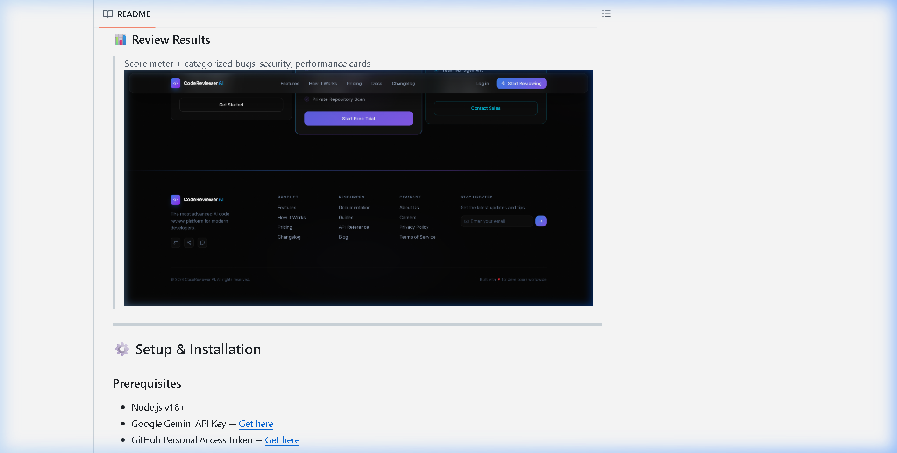

# 🤖 AI Code Reviewer

<div align="center">


### 🚀 Review Your GitHub Pull Requests Instantly with AI

**Paste any GitHub PR URL → Get instant bug detection, security analysis & performance insights in seconds.**

</div>

---

## 🎯 Problem Statement

Developers spend **2–3 hours manually reviewing pull requests**, and critical bugs, security vulnerabilities, or performance issues are still often missed. This leads to:

- ❌ Slow development cycles
- ❌ Bugs reaching production
- ❌ Security vulnerabilities going unnoticed
- ❌ Inconsistent code quality across teams

---

## 💡 Our Solution

An **AI-powered Code Review Agent** that integrates directly with GitHub, fetches PR diffs automatically, and provides categorized, actionable feedback within seconds — **no manual code pasting required.**

---

## ✨ Features

| Feature | Description |
|---------|-------------|
| 🔗 **GitHub PR Integration** | Paste any public GitHub PR URL — app fetches code automatically |
| 🔴 **Bug Detection** | Logic errors, null checks, anti-patterns with exact line numbers |
| 🟠 **Security Analysis** | Hardcoded secrets, SQL injection, XSS vulnerabilities |
| 🟡 **Performance Issues** | Inefficient loops, memory leaks, redundant API calls |
| 🟢 **Code Suggestions** | Naming conventions, code smells, best practices |
| 📊 **Quality Score** | 0–100 visual score meter with Excellent/Good/Poor rating |
| 📋 **PR Summary** | 2–3 line overview of what the PR does |
| 📁 **PR File Tree** | Visual tree of all changed files with additions/deletions count |
| 🕐 **Review History** | Last 5 reviews auto-saved — click to re-review instantly |
| 📋 **Copy Review** | One-click copy of full structured report to clipboard |

---


---

## 📸 Screenshots

### 🏠 Landing Page
> Clean interface with GitHub PR URL input and quick-try examples


### 📊 Review Results
> Score meter + PR File Tree + categorized bugs, security, performance cards



---

## 🛠️ Tech Stack

### Frontend
- ⚛️ **React.js** + **Vite** — Fast, modern UI
- 🎨 **Custom CSS** — Dark theme, fully responsive

### Backend
- 🟢 **Node.js** + **Express.js** — REST API server
- 🤖 **Google Gemini 1.5 Flash** — AI-powered code analysis
- 🐙 **GitHub REST API v3** — Automatic PR diff + file tree fetching

### Architecture Flow
```
User pastes PR URL
      ↓
React Frontend → POST /ai/get-review
      ↓
Node.js Backend
      ↓
GitHub REST API → Fetch PR diff + changed files
      ↓
Gemini AI → Analyze code → Return structured JSON
      ↓
Frontend renders:
  📁 File Tree  →  click to jump to file review
  📊 Score Card →  0-100 quality rating
  📋 Summary    →  PR overview
  🔴 Bugs       →  with file + line + fix
  🟠 Security   →  vulnerabilities
  🟡 Performance → bottlenecks
  🟢 Suggestions → improvements
  📋 Copy Button → clipboard export
  🕐 History    → localStorage saved
```

---

## ⚙️ Setup & Installation

### Prerequisites
- Node.js v18+
- Google Gemini API Key → [Get here](https://aistudio.google.com)
- GitHub Personal Access Token → [Get here](https://github.com/settings/tokens)

### 1. Clone the Repository
```bash
git clone https://github.com/AnkurApex/Ai-Code-Reviewer-.git
cd Ai-Code-Reviewer-
```

### 2. Backend Setup
```bash
cd backend
npm install
```

Create `.env` file inside `/backend`:
```env
GEMINI_API_KEY=your_gemini_api_key_here
GITHUB_TOKEN=your_github_token_here
PORT=3000
```

Start backend:
```bash
npm run dev
```
✅ Backend runs on `http://localhost:3000`

### 3. Frontend Setup
```bash
cd ../frontend
npm install
npm run dev
```
✅ Frontend runs on `http://localhost:5173`

---

## 🧪 Test With These Real PRs

```
https://github.com/expressjs/express/pull/5957
https://github.com/axios/axios/pull/6728
https://github.com/facebook/react/pull/31195
```

---

## 📁 Project Structure

```
Ai-Code-Reviewer-/
├── assets/                            # README screenshots
│   ├── landing.png
│   └── results.png
│
├── backend/
│   ├── src/
│   │   ├── controllers/
│   │   │   └── ai.controller.js       # Request handler — GitHub + AI jodta hai
│   │   ├── routes/
│   │   │   └── ai.routes.js           # POST /ai/get-review route
│   │   └── services/
│   │       ├── ai.service.js          # Gemini AI integration + prompt
│   │       └── github.service.js      # GitHub PR diff + files fetch
│   ├── app.js                         # Express server entry point
│   └── package.json
│
└── frontend/
    ├── src/
    │   ├── components/
    │   │   ├── Header.jsx             # Top navbar
    │   │   ├── InputSection.jsx       # PR URL input + submit
    │   │   ├── LoadingSpinner.jsx     # Loading animation
    │   │   ├── ScoreCard.jsx          # 0-100 quality score meter
    │   │   ├── SummaryBox.jsx         # PR overall summary
    │   │   ├── ReviewCard.jsx         # Bugs/Security/Perf/Suggestions cards
    │   │   ├── FileTree.jsx           # Changed files tree + click to jump ← NEW
    │   │   ├── ReviewHistory.jsx      # Past reviews from localStorage ← NEW
    │   │   └── CopyButton.jsx         # One-click clipboard export ← NEW
    │   ├── services/
    │   │   └── api.js                 # Axios — backend se baat
    │   └── App.jsx                    # Main component — state management
    └── package.json
```

---

## 🆕 What Makes This Different

Most AI code review tools require you to **manually copy-paste code**. Here's what we do differently:

| Feature | Other Tools | AI Code Reviewer |
|---------|-------------|-----------------|
| GitHub Integration | ❌ Manual paste | ✅ Auto PR fetch |
| File Tree View | ❌ | ✅ Click to jump |
| Review History | ❌ | ✅ Last 5 saved |
| Copy to Clipboard | ❌ | ✅ One click |
| Line Numbers in Bugs | ❌ Rare | ✅ Always |
| Fix Suggestions | ❌ Generic | ✅ Per issue |
| Quality Score | ❌ Rare | ✅ 0-100 meter |

---

## 🔮 Future Scope

- [ ] GitHub OAuth — review private repositories
- [ ] Auto-post AI review as GitHub PR comment
- [ ] GitLab & Bitbucket support
- [ ] Slack / Discord alerts for critical security issues
- [ ] PDF export of review report
- [ ] Multi-model support (Claude, GPT-4)
